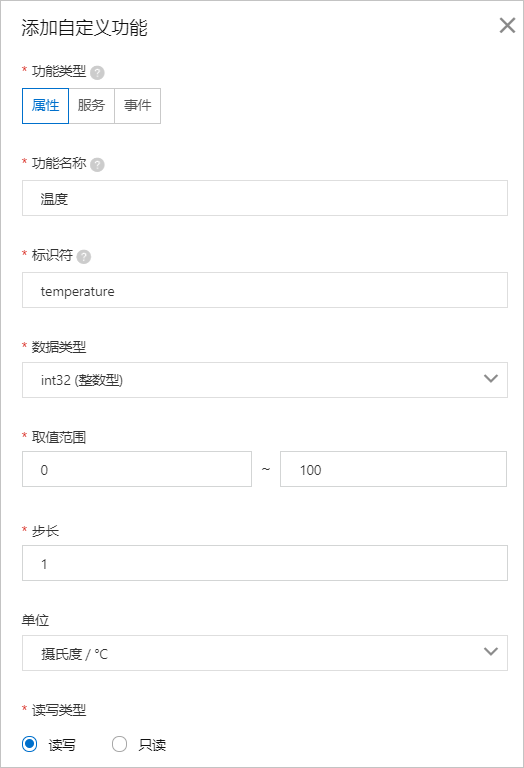
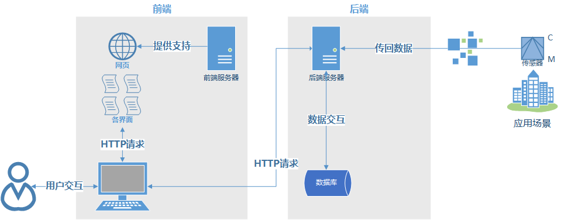
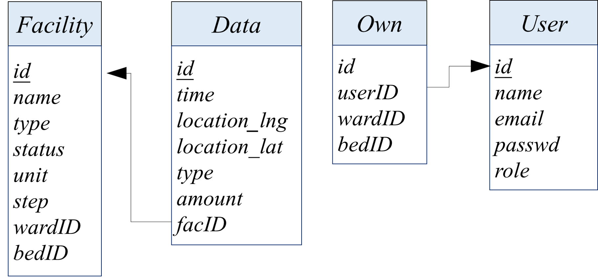
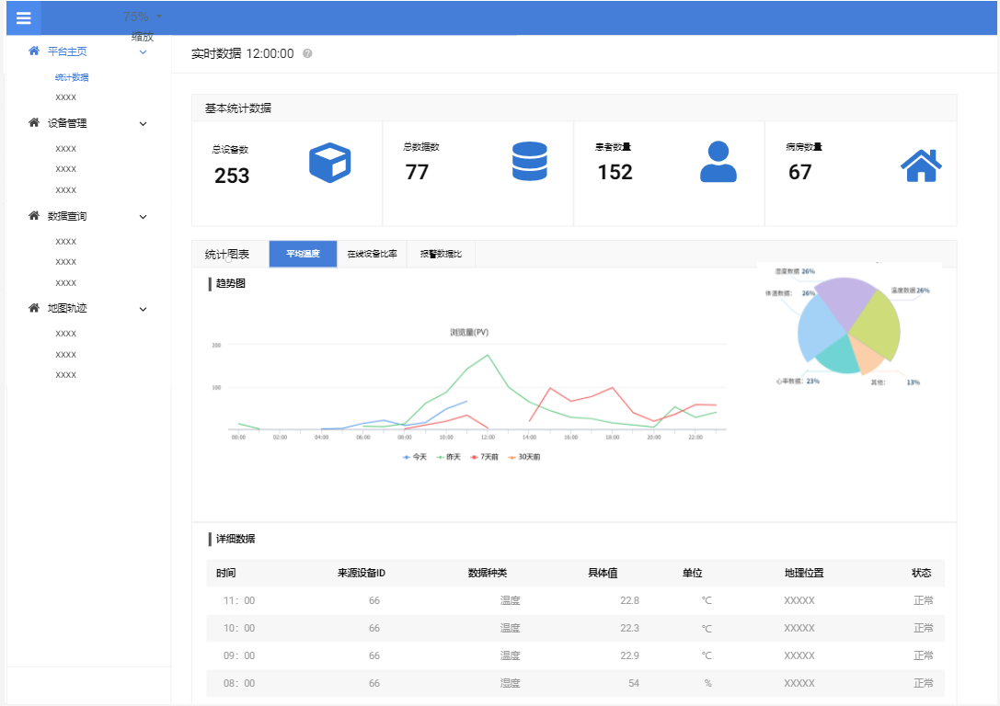
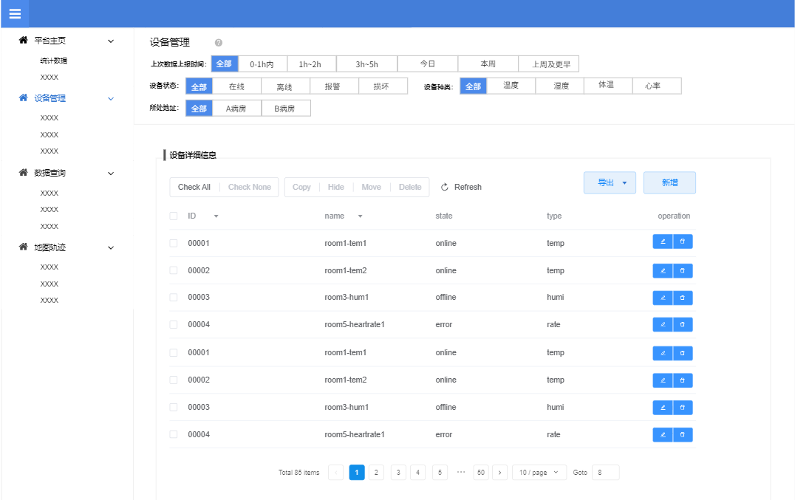
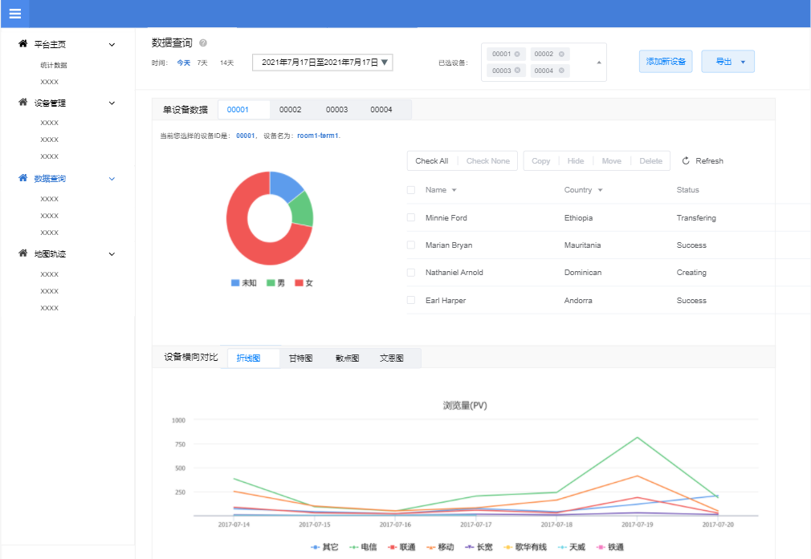
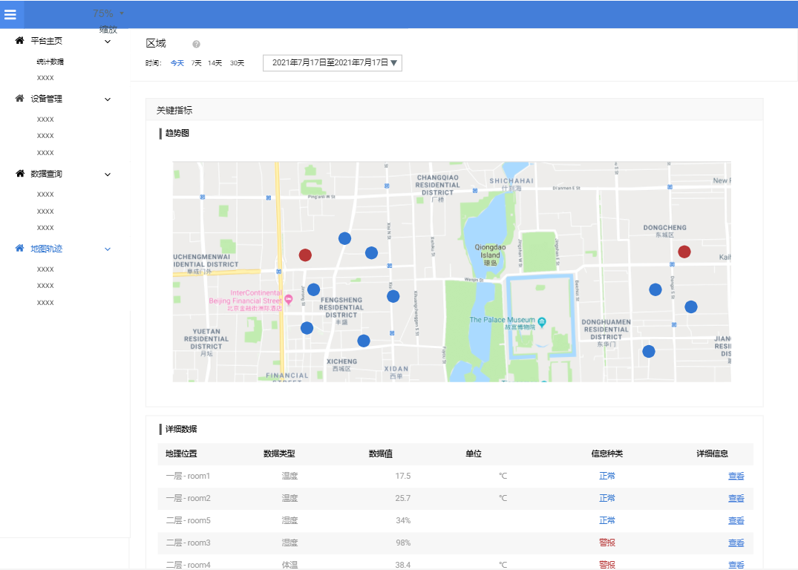

[toc]

## 项目概述

本报告为2021年《B/S体系软件设计》课程项目的设计文档。目的是初步确定项目所需要的技术框架，并针对项目的功能需求设计各功能模块、数据库结构、UI界面原型等要素，为接下来课程项目的进一步开发作计划。

课程项目的主题是“物联网应用网站”。该项目选取的方向是“**智慧病房——医疗物联网系统**”，是一个医疗场景下的物联网应用管理平台。该项目的目标是针对智慧病房中的各物联网设备构建一个交互体验良好、功能完善的管理平台，让用户能够轻松接入和管理物联网设备、收集设备在不同时间和位置发来的数据、并进行丰富全面的可视化数据查询和分析。

由于项目仍在初期设计阶段，以下提及的设计方案可能会在具体实现时有所修改。


## 需求分析

### 基础功能

根据课程实验的相关要求和具体应用场景，本项目将实现以下的基础功能：

1. **搭建一个MQTT服务器，能够接受来自指定物联网终端模拟器的数据。**

   项目将搭建一个MQTT服务器来进行物联网设备的接入、管理、数据传输等操作，MQTT服务器可以通过后端Node.js实现。

   基于智慧病房的应用场景，项目将会涉及包括但不限于以下几种传感器设备：

   - 温湿度：用于监控各个病房的温湿度；每小时获取一次
   - PM2.5：用于监控医院空气质量；每小时获取一次
   - 体温：用于监控病患的体温；每半小时获取一次（位置可变）
   - 心率：用于监控特别患者的心率；每分钟获取一次（位置可变）

   各传感器设备获取数据后，按照设定的周期，通过Wifi发送到项目平台上，并将所测数据和设定的极限数据进行对比，若在范围内则继续工作，若超出上下限（如体温过高）则进入紧急状态，发送报警信号给平台。

   由于设备的限制，本项目不会使用实物传感器，而是利用物联网终端设备模拟器来进行平台的开发和测试。项目拟采用Aliyun IoT平台提供的设备模拟器，该模拟器可以自定义设备的数据类型和单位。

   

2. **实现用户注册、登录功能。用户注册时需要填写必要的信息并验证，如用户名、密码要求在6字节以上，email的格式验证，并保证用户名和email在系统中唯一。**

   - 用户注册时的密码长度等限制可以在前端交互逻辑中实现。
   - 用户名和email的唯一性可以交由后端API在数据库中进行查重，也可以利用数据库主键唯一性的约束来保证。
   - 信息验证可以简单通过后端API在数据库中查询、对比的方式来实现；也可以通过加盐Hash的形式来进行保护，具体实现时拟采用加盐Hash这种更为安全的方式。
   - 用户在实用网址时，登陆状态的保持可以由token以及cookie等多种方式实现。

3. **提供设备配置界面，可以创建或修改设备信息；包含必要信息，如设备ID、设备名称等。**

   在设备配置界面，用户可以：

   - 查看所有已连接设备的信息
   - 修改现有设备的信息
   - 创建新的设备（并进行连接）
   - 删除现有设备（并与之断开连接）

   这一部分，我们只需要通过API读取数据库中现有设备的所有信息并在前端展示出来即可。这里涉及数据库简单的增删改查功能。

   关于设备的必要信息，目前考虑有以下几项：

   - 设备ID：每个设备的ID唯一
   - 名称：用户指定，可与其他设备相同
   - 状态：连接、离线、报警等
   - 类型：如温度、浓度
   - 单位：如℃
   - 上下限：用户设定的合理数据范围
   - 步长：时间步长，即返回数据的时间周期
   - 其他信息可后续增加

   在数据库中，我们将为所有的设备创建一个数据表，每一项对应一个设备。

   由于设备的位置随时间可变，且我们需要记录设备的历史轨迹，所以如果在设备的表中增加“位置”这一项，设计将会变得非常复杂。我们可以专门使用一个表记录设备的轨迹，其中有对应设备ID、经纬度、时间点等数据。这样当我们需要恢复一个设备的历史轨迹的时候，只需要在该表中通过设备ID进行查找，并按照时间进行排序即可。

4. **提供设备上报数据的查询统计界面。**

   通过设备配置界面，用户可以点击特定的设备进入该设备的数据统计页面，在该页面中，用户可以查看到相关的统计数据：

   - 历史数据的折线图 / 柱状图
   - 合理 / 报警数据的比例
   - 其他可视化分析可后续添加

   并且，用户可以对所选的设备和时间进行筛选，只查询观看感兴趣的数据。

   要实现这一功能，只需要在前端通过API获取数据库中相关信息之后，通过可视化工具呈现即可。

5. **提供地图界面展示设备信息，区分正常和告警信息，并可以展示历史轨迹。**

   在该界面中，将会通过一张地图展示当前时间所有设备的地理位置信息，并通过颜色编码区分正常和报警信息。用户也可以在时间轴上选择历史时间点，观看当时的设备位置和信息。

   要实现这一功能，只需要在前端通过API获取数据库中设备信息之后，通过可视化工具呈现即可。

6. **首页提供统计信息（设备总量、在线总量、接收的数据量等），以图表方式展示（柱状体、折线图等）。**

   考虑到设备和数据信息的数据量可能会有一定规模，如果交由前端处理可能会受限于浏览器的性能； 我们可以先由后端对数据进行统计，再将结果通过API传递到前端，前端只需要调用所需的可视化组件即可。

增强功能：

7. **样式适配手机端，能够在手机浏览器/微信等应用内置的浏览器中友好显示。**

   在进行前端设计时，我们可以首先识别出当前是移动端还是桌面端，并相应采用不同的组件布局即可；也可以采用非绝对布局，即按照屏幕的百分比设定组件的长宽度。


### 拓展功能

为了让“智慧病房平台”功能更全面、更有应用价值，本项目还计划增加以下的拓展功能。

1. **设定不同的用户：医生/患者/技术人员，并分配不同的用户权限。**

   - 医生：可以查看病房的所有数据信息，如：温湿度、病人体温等；但不能修改数据记录，不能管理设备。
   - 患者：可以查看自己所在病房的环境数据，如：温湿度、PM2.5；可以查看自己个人的相关数据，如：体温、心率。
   - 技术人员：可以查看所有数据信息，可以对设备进行管理、修改数据记录等，拥有最高权限。

   要实现这部分功能，我们只需要结合用户的登录状态使得一些数据库API可用，一些不可用即可。

2. **增加数据导出功能。**

   用户可以将选定时间范围内、选定设备的数据信息导出为excel等文件格式.

   这部分需要设计相关的数据库接口，同时可能会用到第三方的excel文件读写模块。

3. **对比分析功能。**

   用户可以不局限于分析单个传感器设备的历史数据（功能4）、或是所有设备某一时刻的数据（功能5），用户可以选择多个传感器，对比分析它们的历史数据。如：选择一个病人的“体温”和“心率”两种数据，综合分析病况；选择多个病人的“体温”数据，对比分析。

4. **多样的可视分析功能。**

   对于这一一个数据量大的平台，我们可以使用多种可视化工具辅助数据分析。可以使用的图表形式有：散点图、玫瑰图、热力图等等。目前有许多成熟的前端可视化组件可以利用。


## 技术框架

### 项目框架图



项目整体上采取的是Browser/Server架构，并采用了前后端分离的开发模式。

后端负责提供接口，操作数据库提供给前端所需的数据和状态；前端负责调用接口，将数据展示给用户，并对用户的操作进行简单处理转发给后端，同时还要负责接收来自传感器的数据；数据库负责存储数据。在实际应用场景中，用户可以通过浏览器在不同的网页界面之间浏览，根据网页所需要的数据和用户的操作，浏览器会发出HTTP请求向后端服务器请求数据。后端的MQTT服务器同时在接受来自传感器发送的数据，并存储到数据库中。

### 前端

本项目暂定使用Vue.js作为前端框架。Vue是一套用于构建用户界面的渐进式 JavaScript框架。Vue 的核心库只关注视图层，并且非常容易学习，也非常容易与其他库或已有项目整合。此外，Vue还具有轻量级、组件化、客户端路由等特点，这使得它具有易理解、代码量小的优势，这也是本项目使用 Vue框架的主要原因。希望能够将更多的精力放在整个B/S体系的软件设计与功能实现的层面。

至于UI组件库，我选择了对Vue有较好支持的Element组件库，并参考了前端框架vue-element-admin的逻辑进行设计，该框架是一个基于Vue和ElementUI的后台前端解决方案，拥有设计良好的用户交互界面。

目前项目刚刚开始，代码结构尚不完善。下面简单展示/front-end/src/目录下的各个文件夹结构，并稍作解释。

```
D:.
├─App.vue
├─api
│  ├─usr.js
│  └─***
│   // 该文件下是后端提供的API
├─assets
│  ├─logo.png
│  └─***
│   // 该文件夹下存放了页面所需的图片、字体等文件
├─components
│  ├─HomePage
│  └─***
│   // Vue的各个组件
├─router
│  └─index.js
│   // 页面路由，处理各个页面之间的跳转逻辑
├─store
│  └─modules
└─views
   ├─home
   ├─login
   └─***
    // 具体的各个视图
```

在后期具体实现时，将会不断完善上面的结构。


### 后端

本项目暂定使用Node.js进行后端开发，达成前后端编程环境统一。Node.js是一个基于Chrome V8的JavaScript运行环境，它的特点在于事件驱动和非阻塞I/O，适合做高并发的服务器服务。

至于MQTT服务器的实现，可以使用Java、Javascript、C/C++、Python等多种语言，该项目暂定同样使用node.js使用JavaScript语言来搭建MQTT服务器，也是出于编程语言一致的考虑。但具体实现时，可能会根据实际情况做出调整。

项目的数据库采用的是MySQL数据库，MySQL是一种关系型数据库，采用传统的sql语句进行查询。由于先修的数据库课程，我对MySQL更为熟悉。同时，考虑到MySQL相较于MongoDB更为成熟稳定，且该项目中的数据格式已经非常明确了，所以最后选择采用MySQL数据库。


## 流程图


## 数据库设计

### ER模型



### 表头设计

#### 设备Facility

| 列名  | 说明 |    类型     | 约束 |
| :---: | :---------: | :------: | :---------------------------------: |
| facID | 设备ID | varchar(20) |             Primary Key             |
| name | 设备名 | varchar(30) |                                     |
| type  | 设备类型：温度、湿度、体温、心率 | varchar(10) | in (“temp”, “humi”, “bodyt”, “rate”) |
| state |  设备状态  | varchar(10) |  in (“online”, “offline”, “error”)  |
| unit  | 设备数据单位 | varchar(10) |                                     |
| step | 时间步长（单位：分钟） | INT |                                     |

#### 用户User

|  列名  |   说明   |    类型     |                 约束                 |
| :----: | :------: | :---------: | :----------------------------------: |
| userID |  用户ID  | varchar(20) |             Primary Key              |
| email  | 注册邮箱 | varchar(50) |          Not Empty & Unique          |
|  name  |  用户名  | varchar(30) |          Not Empty & Unique          |
| passwd | 用户密码 | varchar(40) |              Not Empty               |
|  type  | 用户种类 | varchar(10) | in (“doctor”, “patient”, “manager” ) |

#### 用户设备对应关系Own

该关系表示userID用户（患者）对应facID（体温、心率）

|  列名  |    说明    |    类型     | 约束 |
| :----: | :--------: | :---------: | :--: |
| userID | 对应用户ID | varchar(20) |      |
| facID  | 对应设备ID | varchar(20) |      |

#### 数据Data

|  列名  |    说明    |    类型     | 约束 |
| :----: | :--------: | :---------: | :--: |
| _ID | 该记录ID编号 | INT | Primary Key |
| facID | 对应设备ID | varchar(20) |      |
| time | 数据接收的时间 | datetime |      |
| location | 设备发送消息时所处的经纬度 | varchar(50) | |
| **wradID** | **病房ID** | **INT** | |
| type | 数据类型 | varchar(15) | in (“normal”, “warning”) |
| amount | 具体数据值 | demical(3, 2) | |


### 数据库API设计

以下是后端提供给前端的数据库相关API，具体实现的时候将根据情况修改，前端测试时可以使用POSTMAN工具进行调试。

#### 用户登录相关

|     接口名     | 类型 |              说明              |
| :------------: | :--: | :----------------------------: |
|  create_user   | POST |           创建新用户           |
| get_user_info  | GET  | 从User表中获取该用户的个人信息 |
| edit_user_info | POST |        用户修改个人信息        |
|    del_user    | DEL  |       从User表中删除用户       |
|   user_login   | POST |            登录验证            |

#### 设备管理相关

|      接口名       | 类型 |                       说明                        |
| :---------------: | :--: | :-----------------------------------------------: |
| get_patient_facID | GET  |    从own表中获取该患者对应设备号（体温、心率）    |
|    get_fac_num    | GET  | 获得现有设备的数量（可通过参数设定对state的筛选） |
|   get_fac_info    | GET  |     从Facility表中根据ID获取该设备的所有信息      |
|   edit_fac_info   | GET  |             （管理员）修改设备的信息              |

#### 数据查询相关

|    接口名    | 类型 |                     说明                     |
| :----------: | :--: | :------------------------------------------: |
| get_fac_data | GET  |    在Data表中根据设备的ID查询所有相关记录    |
| get_fac_loca | GET  | 在Data表中根据设备的ID和时间范围查询地理位置 |


## UI原型设计

为方便进一步的前端开发，在设计阶段，我们以UI原型的方式对前端界面进行初步设计。后续在实际开发中，再进行具体的功能细化和风格美化。接下来将简单介绍主页、设备管理界面、数据查询界面、地图界面四个主要界面的交互逻辑。

### 主页

页面的左方一列是导航栏，用户可通过点击跳转到其他页面。

主页将会显示系统的一些基本统计数据，如：总设备数、总数据记录数、患者数量、病房数量等。并且会通过一些图表的形式将这些统计数据可视化，设计原型中展示了平均温度的折线图、数据种类的饼图等。主页的最底部将会以表格的形式动态显示当前时刻最新接收到的数据信息。主页的数据将不断更新，显示实时数据，当前页面对应的时间可以在首最顶部看到，页面中显示的是12:00:00。

#### 用到的接口

- get_fac_num：设备总数 / 不同state的设备比例饼图
- *get_data_num*：总数据量
- *get_patient_num*：总患者数
- *get_ward_num*：总病房数
- *get_new5_data*：获取最新的五条数据记录
- 平均温度->折线图




### 设备管理界面

设备管理的主体部分是一张表格，其中列出了系统中接入的所有设备信息。用户也可以通过上部的筛选条件对设备进行筛选，如：设备状态、设备种类、所处位置等。通过表格每条记录右端的按钮，用户可以对设备进行修改和删除。同时，点击单个设备或勾选多个设备后点击按钮，用户将跳转到数据查询界面，查看这些设备接收到的数据信息。

通过”新增“按钮，用户可以接入新的设备；通过”导出“按钮，用户可以直接将设备信息导出为Excel或其他文件形式。

#### 用到的接口

- get_patient_facID：显示当前用户可看的设备数
- （前端筛选）
- 根据变量“userType”确定是否显示“设备删除”按钮




### 数据查询界面

在数据查询界面，用户可以选择特定的设备查看它们发送来的数据，选择的设备数可以是一个也可以是多个。同时，用户可以对感兴趣的时间段进行筛选，原型设计中给出了点选”今天、7天、14天、30天“和通过日历勾选两种方式。

对具体的设备数据，有两个展示区块：第一个是单个设备的数据显示，图中显示了饼图和详细的数据表格，用户可以在不同的设备间切换，该部分将用于展示单个设备的数据分布情况；第二个是不同设备数据之间的对比图表，如图中将在一张折线图中同时展示多个设备的数据信息，用户可以通过Tab按钮查看不同的可视化图表，也可以在右上方的”已选设备“中选择新的设备、删除现有已选设备。

#### 用到的接口

- get_all_faci_id：获取所有设备id，用于筛选框
- get_fac_data：根据设备id获取所有数据（如图中需要获取0001、0002、0003、0004）




### 地图界面

该界面的主体是一张地图，实际部署时可以更换为医院地图。

地图上分布着红色和蓝色两种圆点，其中蓝色表示一次正常数据的接收，红色则表示警报数据。通过上方的”时间“区块，用户可以选择感兴趣的时间区间，查看该区间内的数据分布。在地图的下方是一张详细数据表格，其中展示了地图中显示的所有数据记录的信息，同时也标注了”正常“和”警报“，用户可以右端的”查看“按钮查看数据的详细信息。

此外，项目还计划加入一些友好的交互功能，如鼠标悬停地图中的圆点则浮现对应数据的信息框、表内记录高亮等。

