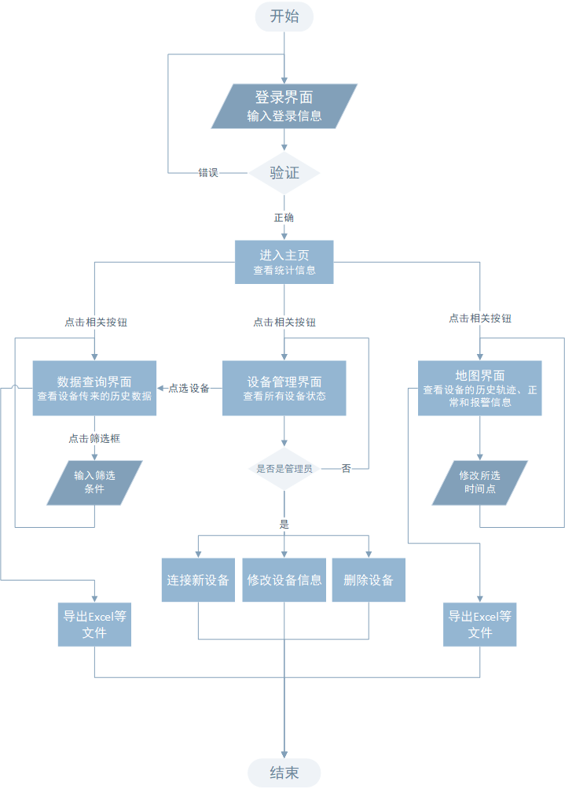
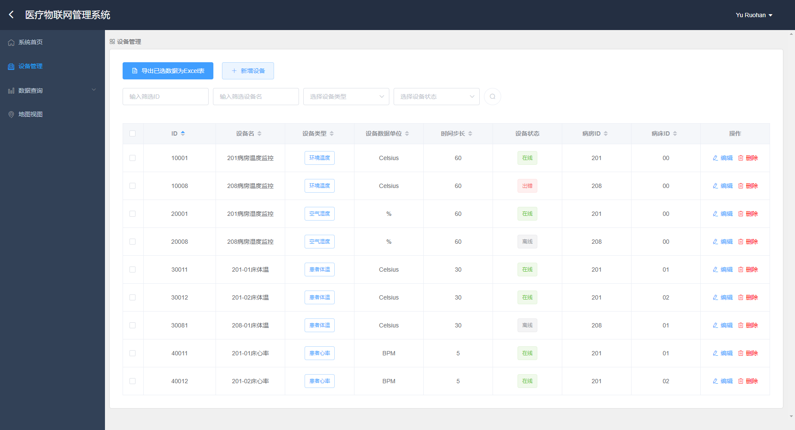
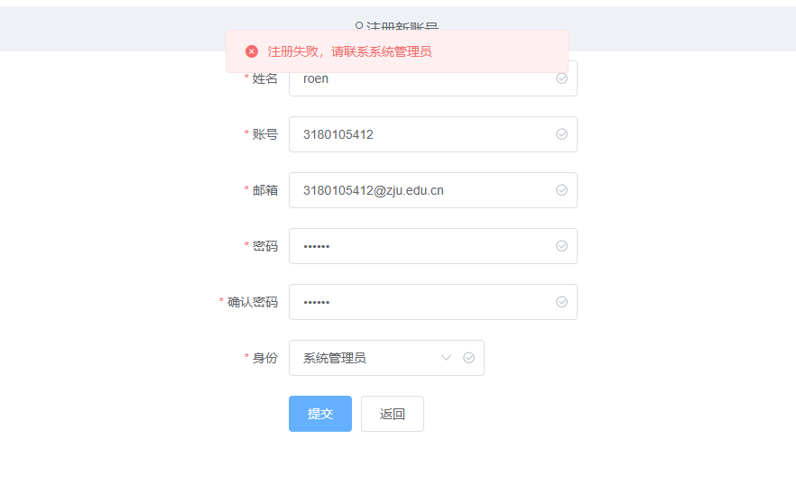
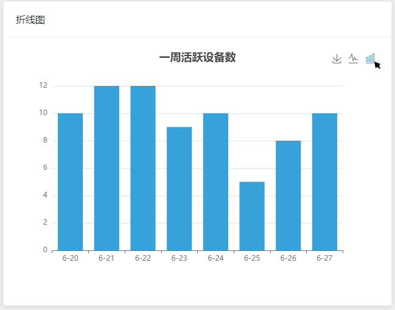
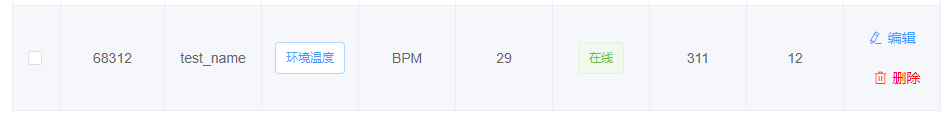

# 一、设计文档

## 1 项目概述

本报告为2021年《B/S体系软件设计》课程项目报告的第一部分——设计文档。

该文档写于项目开始前，并在开发过程中进行修改和完善。

设计文档的目的是分析确定项目的功能需求，初步确定项目所需要的技术框架，设计项目整体的体系结构、各模块的功能，并初步确定数据库结构、UI界面原型等要素，为接下来课程项目的进一步开发打下基础。

课程项目的主题是“物联网应用网站”。该项目选取的方向是“**智慧病房——医疗物联网系统**”，意在构建一个医疗场景下的物联网应用管理平台。该项目的适用范围是接入了只能物联网设备的医院、病房，适用用户是医院管理员、医生和病患，项目将针对智慧病房内的物联网设备构建一个交互体验良好、功能完善的管理平台，让使用者能够轻松接入和管理物联网设备、收集设备在不同时间和位置发来的数据、并进行丰富全面的可视化数据分析。

**相较于初版设计文档，该版本增加了：**

 - **新的扩展功能**
 - 各功能具体实现方法的细节说明
 - 使用**技术栈的更新**
 - 技术栈的细节说明
 - 数据库表头的微小更新
 - API更新


## 2 需求分析

### 2.1 基础功能

本项目设定的应用场景是医院物联网系统管理。我们假定目标医院下有设多个病房，每个病房内设有多张病床。每个物联网设备可以部署到一个病房（如室内温度、湿度监控设备），也可以部署到一张病床（如病人生命体征心率、体温监控设备）。系统的使用者包括该系统的管理人员、医生、病患三种类型。

根据课程实验的相关要求和具体应用场景，本项目实现了以下的基础功能：

1. **搭建一个MQTT服务器，能够接受来自指定物联网终端模拟器的数据**（已实现）

   项目将搭建一个简单的MQTT服务器，该服务器可以实现

   - 与MQTT主服务器的连接
   - 订阅和取消订阅指定Topic
   - 接收该Topic上的消息
   - 向该Topic上发送消息

   **实现方法：**

   该功能使用Python语言，基于`paho-mqtt`库、EMQ X CLOUD免费公用服务器实现。

   `paho-mqtt`是目前Python中使用较多的MQTT客户端库，它提供了一些基础MQTT辅助函数，使得和MQTT服务器的连接变得简单。

   [EMQ X CLOUD](https://www.emqx.cn/mqtt/public-mqtt5-broker)是一款开源的物联网MQTT免费公用服务器。

   本项目分别实现了向服务器发送（publish）、订阅并接受（subscribe）的两个Python程序。通过调用`paho-mqtt`提供的函数，设定好连接参数，程序就可以接入EMQ X CLOUD服务器，并在名为`python-mqtt/tcp`的Topic下进行不停发送和接收数据。

   

2. **实现用户注册、登录功能。用户注册时需要填写必要的信息并验证，如用户名、密码要求在6字节以上，email的格式验证，并保证用户名和email在系统中唯一**（已实现）

   项目中对用户信息的约束如下：

   - 用户名非空，可重复
   - 账号非空（满足浙江大学学号格式），不可重复
   - 邮箱非空，不可重复
   - 密码长度至少为6

   **实现方法：**

   首先，在用户注册的前端界面中，对表单的输入进行约束，此时可以保证必要信息非空、邮箱满足邮箱格式、账号满足浙江大学学号格式、密码长度至少为6。若不满足这些要求，前端界面会给出提示，并且禁止提交表单。

   其次，在后端实现中，后端会对前端发来的注册信息进行查重，如果发现账号和邮箱号在数据库中已存在，则会返回错误信息。

   最后，在数据库层面，我们在创建用户信息表的时候就对表内各字段进行primary key、unique的约束，保证不合规范的信息无法插入表。

   对于登录状态的保持，使用HTML5新支持的特性——localStorage实现。该方法类似于sessionStorage，但其生命周期是永久的，且可以在不同标签页间共享，免去了反复登录的繁琐。

   

3. **提供设备配置界面，可以创建或修改设备信息；包含必要信息，如设备ID、设备名称等**（已实现）

   提供”设备管理“界面，在该界面用户可以：

   - 查看所有现有设备的信息，包括

     - 设备ID：设备的唯一标识符
     - 设备名
     - 设备状态：在线、离线、故障
     - 数据类型：室温、室内湿度、患者体温、患者心率
     - 数据单位
     - 时间步长：设备两次发送数据的实际间隔
     - 病房ID：设备所部署的病房ID 
     - 病床ID：设备所部署的病床ID（若未部署到具体病床，则该项设为某特殊值）

   - 修改现有设备的信息

     用户只能修改除设备ID外的其他信息

   - 创建新的设备

     用户输入除设备ID外的其他信息，提交后由后端分配一个ID

   - 删除现有设备

   - 通过关键字对设备进行筛选（新增）

     可供筛选的字段有：

     - 设备ID
     - 设备名
     - 数据类型
     - 设备状态

   - 将勾选的设备信息导出为excel表格（新增）

     可通过勾选框勾选设备行，通过按钮导出已选设备到excel表格，下载保存到本地。

   **实现方法：**

   在数据库中，我们使用单独的一张表格tb_facility保存所有设备的所有信息。后端将会向前端提供该表的增、删、改、查接口。在前端界面中，使用一个单独的界面作为”设备管理“界面。

   - 前端通过后端的”查“接口获取所有设备的信息并以表格的形式显示在网页中。对表格的每一列提供”编辑“和”删除“的按钮，并在表格前单独显示”新增设备“按钮。用户触发相应按钮、填写必要信息并提交后，前端将会调用后端提供的”增“、”改“、”删“接口对数据库内的设备信息进行修改。同时重新获取所有设备信息，刷新页面。
   - 对于信息的筛选，则完全交由前端实现。用户输入筛选关键词后，前端从原始数据中筛选出包含关键词的数据行并显示，不包含关键词的则不作显示。
   - 对于导出excel这一功能，同样由前端完成。首先通过JavaScript实现一个小组件，完成对JSON数据进行分析并导出为excel的功能；具体在”设备管理“界面中，点击”导出excel“按钮后，将会把勾选的数据交由这一组件进行处理、导出。

   

4. **提供设备上报数据的查询统计界面**（已实现）

   提供”数据总览“界面，在该界面用户可以：

   - 查看系统所有数据的信息，包括：
     - 该条数据的ID：一条数据的唯一标识符
     - 发送该条数据的设备ID
     - 数据的发送时间
     - 数据的发送位置
       - 经度
       - 纬度
     - 数据的具体数值
     - 数据的单位：由设备确定
     - 数据的类型：室温、室内湿度、患者体温、患者心率，同样由设备确定
     - 设备是否正常：正常、警告
   - 删除一条数据
   - 通过关键字对数据进行筛选（新增）
   - 将勾选的数据导出为excel表格（新增）

   **实现方法：**

   我们单独使用一张表格tb_data保存接收到的所有数据信息。

   需要注意的时，显示数据信息时，后端返回所有数据信息时，还要通过查询tb_facility设备返回该条数据对应设备的信息：如数据单位和数据类型。

   该界面其他功能（数据筛选、导出Excel）和上一部分”设备管理“界面实现方法类似。

   

5. **提供地图界面展示设备信息，区分正常和告警信息，并可以展示历史轨迹**（已实现）

   提供”地图视图“界面，在该界面：

   - 显示一张地图，地图上每条数据信息都对应了一个标记点。
     - 标记点的位置反映该条数据的发送位置
     - 标记点的图表（正常、警告）反映了该条数据是否正常
   - 用户可以通过”显示轨迹线“开关，控制地图是否显示轨迹线。
     - 每条轨迹线都按照时间顺序连接了同一个设备发送的所有数据
     - 轨迹线反映了设备的移动轨迹
   - 用户可以通过筛选框，选择只看某个设备的数据标记点和轨迹线
   - 用户可以点击地图中的数据标记点，通过信息窗口查看该条数据的详细信息
   - 地图下方将会显示一张数据表格，具体展示当前地图中所有数据标记点的详细信息

   **实现方法：**

   - 前端通过[Google Map](https://developers.google.com/maps/documentation/javascript/overview)调用地图显示API，显示地图。
   - 后端提供接口：
     - 标记点：遍历数据，每条数据形成一个地图Marker，返回所有Marker配置信息，传给前端在地图上渲染。
     - 轨迹线：遍历设备，对每个设备，查询由其发送的数据并按照时间排序，从而构建一条轨迹线（Polyline）配置信息，返回所有轨迹线信息传给前端在地图上渲染。
   - 筛选功能同上两个模块。
   - 在前端，对标记点实现点击处理函数，用户点击标记点后，相应的信息窗口呈显示状态，用户点击关闭后点击其他标记点后，原信息窗口呈关闭状态。信息窗口的信息由后端提供，和Marker配置信息一同返回。

   

6. **首页提供统计信息（设备总量、在线总量、接收的数据量等），以图表方式展示（柱状体、折线图）等**（已实现）

   提供”系统首页“界面，在该界面：

   - 显示系统统计信息：
     - 总设备数
     - 总数据量
     - 注册患者总数
     - 病房数量
   - 显示可视化图表：
     - 一周内活跃设备数量变化情况（折线图，柱状图）
     - 一周内总数据量变化情况（折线图，柱状图）
     - 一周内注册患者数变化情况（折线图，柱状图）
     - 一周内活跃病房数变化情况（折线图，柱状图）
     - 现有数据”正常“”警告“比例及数量（饼图）
     - 现有设备”在线“”离线“”故障“比例及数量（饼图）

   **实现方法：**

   考虑到设备和数据信息的数据量可能会有一定规模，如果交由前端处理可能会受限于浏览器的性能。为了实现这一功能，后端提供了相关的接口，由后端直接对数据库数据进行统计，再将结果传递到前端，前端只需要调用所需的可视化组件显示即可。

增强功能：

7. **样式适配手机端，能够在手机浏览器/微信等应用内置的浏览器中友好显示**（已实现）

   **实现方法：**
   
   - 前端界面的css格式，不采用绝对布局（使用`px`作为单位固定组件长宽），而是使用屏幕长宽的百分比设定组件大小。
   - 采用 `@media `等自适应布局，根据设备信息设置组件的长宽。


### 2.2 扩展功能

为了让“智慧病房平台”功能更全面、更有应用价值，本项目还计划增加以下的拓展功能。

1. **设定不同的用户：管理人员/医生/患者，并分配不同的用户权限**（部分实现）

   - 管理人员：
     - 可以查看所有数据
     - 可以修改设备信息、删除设备
     - 可以删除数据
   - 医生：
     - 可以查看所有信息
     - 不能进行信息的修改和删除
   - 患者：
     - 只能查看自己所在病房的环境数据，如：室内温湿度（未实现）
     - 只能查看自己的个人数据，如：体温、心率（未实现）
     - 不能进行信息的修改和删除

   **实现方法：**

   主要由前端实现。

   - 首先，需要通过localStorage保存当前登录用户的身份信息。
   - 在前端路由设置中，设定低权限用户无法访问某些界面。当检测到低权限用户发出跳转到高权限页面的请求时，将页面重定向到403页面。
   - 在前端页面设计时，利用`v-if`属性，对于低权限用户，不显示相关操作的入口。

   具体实现时，完全实现了管理人员和医生的权限，对于患者的权限，只是实现了高权限界面不可见，没有实现对个人数据的访问。

   

2. **增加数据导出功能**（已实现）

   用户可以将选定时间范围内、选定设备的数据信息导出为excel等文件格式。

   **实现方法：**

   在基础功能部分已经介绍过。

   

3. **对比分析功能**（未实现）

   用户可以不局限于分析单个传感器设备的历史数据（功能4）、或是所有设备某一时刻的数据（功能5），用户可以选择多个传感器，对比分析它们的历史数据。如：选择一个病人的“体温”和“心率”两种数据，综合分析病况；选择多个病人的“体温”数据，对比分析。

   

4. **多样的可视分析功能**（基本实现）

   对于这一一个数据量大的平台，我们可以使用多种可视化工具辅助数据分析。可以使用的图表形式有：散点图、玫瑰图、热力图等等。目前有许多成熟的前端可视化组件可以利用。

   **实现方法：**

   主要通过调用echarts组件，设定不同的配置参数实现。目前实现了：

   - 基本图表的显示
   - 同一份数据，用户可在不同类型图表中切换
   - 图表可保存为图片到本地

   

5. **系统主页显示实时时钟，并每秒 / 每分更新页面显示数据**（已实现）

   为了更好地契合应用场景，在系统主页增加了时钟显示，每分钟刷新时钟，同时获取最新的统计信息、最新接收的数据信息并显示在表格中。

   **实现方法：**

   主要由前端实现。在前端界面开始渲染前，定义一个timer，设定其每分钟执行指定任务（也可设定为每秒钟），包括——刷新时钟的时间、重新获取首页统计数据、重新获取按照时间排序的数据信息。

   

6. **主页统计信息模块，增加友好的用户交互功能**（已实现）

   主页以卡片的形式显示系统的基本统计数据，同时，若用户点击卡片，则主页的图表显示该卡片对应数据类别的统计图表。如：用户点击”总数据量“卡片，则图表显示为”一周内总数据量变化情况“折线图。

   **实现方法：**

   在前端界面维护一个变量指定当前需要显示的图表。并实现卡片点击的响应函数，检测到点击事件发生后，更改相关变量的值。同时，图表需要与该变量绑定，以实现图表的即时变化。


## 3 系统流程图

注意：

该流程图为项目初期设计，只能作大体参考，后续在此基础上修改了很多细节。具体流程请阅读后续文档。




## 4 技术框架

### 4.1 项目框架图


项目整体上采取的是Browser/Server架构，并采用了前后端分离的开发模式。

后端负责提供接口，操作数据库、获取需要提供给前端所需的数据和状态，同时还要负责接收来自传感器的数据；前端负责调用接口，将数据展示给用户，并对用户的操作进行简单处理转发给后端；数据库负责存储数据，维护数据之间的约束。

在实际应用场景中，用户可以通过浏览器在不同的网页界面之间浏览，并发起一定的操作。根据网页所需要的数据和用户的操作，浏览器会发出HTTP请求向后端服务器请求数据。后端运行的服务器接收来自前端的请求，根据前端传来的参数对数据库进行增删改查，并将操作结果返回给前端。MQTT服务器接受来自传感器发送的数据，并存储到数据库中。

本项目将尽量采用符合RESTful风格的API进行前后端数据交互。

### 4.2 前端技术与实现

#### 4.2.1 前端服务器开发

本项目采用Vue.js作为前端框架。Vue是一套用于构建用户界面的渐进式 JavaScript框架。Vue 的核心库只关注视图层，并且非常容易学习，也非常容易与其他库或已有项目整合。此外，Vue还具有轻量级、组件化、客户端路由等特点，这使得它具有易理解、代码量小的优势，这也是本项目使用 Vue框架的主要原因。希望能够将更多的精力放在整个B/S体系的软件设计与功能实现的层面。

至于UI组件库，我选择了对Vue有较好支持的Element组件库，并参考了前端框架vue-element-admin的逻辑进行设计，该框架是一个基于Vue和ElementUI的后台前端解决方案，拥有设计良好的用户交互界面。

前端网页视图主要分为五个部分，分别是“系统主页”、“设备管理”、“数据总览”、“地图视图”以及用户“登陆注册”页面。前四个页面共享同一个导航栏和页面标题栏。

#### 4.2.2 前端目录结构

下面简单展示/front-end/src/目录下的各个文件夹结构。

- App.vue / main.js：程序的入口，前端中需要的各个组件可以在main.js中进行全局注册。
- /api：定义了前端所要调用的接口和相关的请求类型、请求URL。
- /assets：存储页面需要的CSS样式和图片
- /components：定义基础组件，可被各个具体始图调用。这里定义了标题栏和导航栏组件，由各个视图共享。
- /router：定义页面的跳转路由，对路径进行重定向。
- /store：维护各个页面间共享的数据和方法。
- /utils：一些基本工具，如：定义了Email的正则表达式。
- /vendor：第三方工具，包括导出Excel的该工具。
- /views：具体的各个视图，包括“系统主页”、“设备管理”、“数据总览”、“地图视图”以及用户“登陆注册”这五类主视图和403视图。

```
/front-end/src
│  App.vue
│  main.js
│
├─api
│      charts.js
│      data.js
│      facility.js
│      index.js
│      user.js
│
├─assets
│  └─css
│         color-dark.css
│         icon.css
│         main.css
│
├─components
│      Header.vue
│      Home.vue
│      Sidebar.vue
│
├─router
│      index.js
│
├─store
│      index.js
│
├─utils
│      request.js
│      utils.js
│
├─vendor
│      Export2Excel.js
│
└─views
    │  403.vue
    │
    ├─dashboard
    │      Dashboard.vue
    │
    ├─data
    │      Detail.vue
    │      Overview.vue
    │
    ├─facility
    │      Facility.vue
    │
    ├─map
    │      Map.vue
    │
    └─user
            Login.vue
            Register.vue
```


### 4.3 后端技术与实现

本项目最终采用了Python进行后端开发。

#### 4.3.1 后端服务器开发

采用Flask框架完成后端服务器的编写。Flask是一个用Python编写的轻量级Web应用程序框架。它使用简单的核心，没有默认使用的数据库、窗体验证工具，但可以通过使用extension增加其他功能。本项目使用了以下的Flask基本功能和扩展功能：

- Blueprint：使用Blueprint可以在不同的文件中定义接口，并一同注册到Flask主程序中，实现Flask开发的模块化。
- flask_sqlalchemy：SQLAlchemy是Python中最常用的ORM（Object-Relationl Mapping）框架，它能够在关系型数据库和对象之间实现映射，开发者无需直接编写原生SQL语句，而可以使用操作对象的方式操作数据库中的表、对数据进行增删改查。
- flask_migrate：flask_migrate是处理SQLAlchemy数据迁移的工具。当数据模型发生变化时，flask_migrate可以将修改后的内容重新映射到数据库，完成后端与数据库的同步。
- flask_cors：实现跨域资源共享，使得本地前端服务器可以向本地后端服务器发起请求。

此外，开发时采用虚拟环境，通过`virtualenv`在工程目录下创建虚拟环境`venv`，将所有第三方包安装在该虚拟环境下。采用虚拟环境的开发方式为应用提供了隔离的Python运行环境，解决了不同应用间多版本的冲突问题，也使得应用更利于迁移。

#### 4.3.2 MQTT服务器开发

MQTT服务器使用Python语言开发，基于`paho-mqtt`库、EMQ X CLOUD免费公用服务器。

`paho-mqtt`是目前Python中使用较多的MQTT客户端库，它提供了一些基础MQTT辅助函数，使得和MQTT服务器的连接变得简单。

[EMQ X CLOUD](https://www.emqx.cn/mqtt/public-mqtt5-broker)是一款开源的物联网MQTT免费公用服务器。

本项目分别实现了向服务器发送（publish）、订阅并接受（subscribe）的两个Python程序。通过调用`paho-mqtt`提供的函数，设定好连接参数，程序就可以接入EMQ X CLOUD服务器，并在名为`python-mqtt/tcp`的Topic下进行不停发送和接收数据。

#### 4.3.3 后端目录结构

下面简单展示/back-end/目录下的各个文件夹结构。

- Flask：后端服务器
  - app.py：后端主程序，用于启动服务器
  - configs：储存数据库的基本配置
  - manage：用于进行数据库迁移（Migrate）
  - requirement.txt：虚拟环境中导出的Python环境要求
  - api：定义后端提供的api、路由地址、接收的请求方式
  - database
    - extension：定义数据库
    - models：定义数据库的表头
    - schema：可用于初始化数据库的SQL文件，包括测试数据的插入
  - migration：数据库迁移信息，由manage.py自动生成
  - venv：由`vitrualenv`生成的虚拟环境
- mqtt：MQTT服务器
  - mqtt_pub：模拟物联网设备向指定Topic发送数据
  - mqtt_sub：本项目需要实现的服务器，订阅指定Topic并接收数据

```
/back-end
├─flask
│  │  app.py
│  │  configs.py
│  │  manage.py
│  │  requirement.txt
│  │
│  ├─api
│  │     charts.py
│  │     data.py
│  │     facility.py
│  │     format.py
│  │     user.py
│  │
│  ├─database
│  │     extension.py
│  │     models.py
│  │     schema.sql
│  │
│  ├─migrations
│  │
│  └─venv
│
└─mqtt
        mqtt_pub.py
        mqtt_sub.py
```


## 5 数据库设计

### 5.1 ER模型


### 5.2 表头设计

#### 5.2.1 设备Facility

| 列名  | 说明 |    类型     | 约束 |
| :---: | :---------: | :------: | :---------------------------------: |
| id | 设备ID | varchar(10) |             Primary Key             |
| name | 设备名 | varchar(30) | Not Null |
| type  | 设备类型：温度、湿度、体温、心率 | enum (“temp”, “humi”, “bodyt”, “rate”) | Not Null |
| status |  设备状态  | enum(“online”, “offline”, “error”) |  Not Null  |
| unit  | 设备数据单位 | varchar(10) | Not Null |
| step | 时间步长（单位：分钟） | decimal(4,2) | Not Null |
| wardID | 设备部署的病房ID | varchar(10) |  |
| bedID | 设备部署的病床ID | varchar(10) |  |

#### 5.2.2 用户User

|  列名  |   说明   |                  类型                  |        约束        |
| :----: | :------: | :------------------------------------: | :----------------: |
|   id   |  用户ID  |              varchar(10)               |    Primary Key     |
|  name  |  用户名  |              varchar(30)               |     Not Empty      |
| email  | 注册邮箱 |              varchar(50)               | Not Empty & Unique |
| passwd | 用户密码 |              varchar(430)              |      Not Null      |
|  role  | 用户种类 | enum (“doctor”, “patient”, “manager” ) |      Not Null      |

#### 5.2.3 用户设备对应关系Own

该关系表示userID用户（患者）安置在wardID对应病房、bedID对应病床。

|  列名  |    说明    |    类型     |    约束     |
| :----: | :--------: | :---------: | :---------: |
|   id   |   记录ID   | varchar(10) | Primary Key |
| userID | 对应用户ID | varchar(10) |  Not Null   |
| wardID | 对应病房ID | varchar(10) |  Not Null   |
| bedID  | 对应病床ID | varchar(10) |  Not Null   |

#### 5.2.4 数据Data

|  列名  |    说明    |    类型     | 约束 |
| :----: | :--------: | :---------: | :--: |
| id | 该记录ID编号 | varchar(10) | Primary Key |
| time | 数据接收的时间 | datetime | Not Null |
| location_lng | 设备发送消息时所处的经度 | decimal(9,6) | Not Null |
| location_lat | 设备发送消息时所处的纬度 | decimal(9,6) | Not Null |
| type | 数据类型 | enum(“normal”, “warning”) | Not Null |
| amount | 具体数据值 | demical(5, 2) | Not Null |
| facID | 对应设备ID | varchar(10) | Not Null |


## 6 前后端API设计

以下是后端提供给前端的数据库相关API设计。

API的具体文档已经通过Postman导出：[Postman Document 2021iot](https://documenter.getpostman.com/view/16400537/TzedhQAF)。下面只作简单的展示。


### 6.1 用户登录相关 (User)

|      接口名      | 类型 |     说明     |
| :--------------: | :--: | :----------: |
| **userRegister** | POST |   用户注册   |
|  **userVerify**  | POST | 用户登录验证 |

### 6.2 设备管理相关 (Facility)

|       接口名       | 类型 |                      说明                       |
| :----------------: | :--: | :---------------------------------------------: |
| **getAllFacility** | GET  |           获取所有facility的基本信息            |
| **removeFacility** | POST | “移除”某设备，并不删除，而是将其name改为“_null” |
| **updateFacility** | POST |                  更新设备信息                   |
|  **addFacility**   | POST |                    增加设备                     |

### 6.3 数据查询相关 (Data)

|       接口名       | 类型 |                    说明                     |
| :----------------: | :--: | :-----------------------------------------: |
| **getBasicStatic** | GET  |            获取系统基本统计数据             |
|   **getAllData**   | POST | 按照一定的limit、sort获取Data表内的数据记录 |
|   **deleteData**   | DEL  |          给出id，删除对应数据项。           |

### 6.4 图表显示相关 (Charts)

|       接口名       | 类型 |                 说明                 |
| :----------------: | :--: | :----------------------------------: |
|   **getFacPie**    | GET  | 用于饼图，返回facility三种状态的个数 |
|   **getDataPie**   | GET  |   用于饼图，返回data两种状态的个数   |
|   **getAllLine**   | GET  | 用于折线图，返回四类折线图的配置数据 |
| **getAllMarkers**  | GET  |   用于地图，返回所有marker配置数据   |
| **getAllPolyline** | GET  |     用于地图，返回所有的折线信息     |


## 7 UI设计

为方便进一步的前端开发，在设计阶段，我们以UI原型的方式对前端界面进行初步设计。后续在实际开发中，再进行具体的功能细化和风格美化。

**更新：**

该版本提交的是最终实现的效果。

接下来将简单介绍登录界面、系统主页、设备管理、数据查询、地图视图四个主要界面的交互逻辑。

### 7.1 登录注册

#### 7.1.1 登录界面

输入账号和密码后登录。


#### 7.1.2 用户注册界面

输入基本信息，选择身份。


### 7.2 系统主页

页面的左方一列是导航栏，用户可通过点击跳转到其他页面。

主页由多个卡片组成。最顶部的卡片将会显示用户的基本信息，如：用户名、用户账号、注册邮箱、用户身份。

右上角的卡片显示的是系统实时时间，该时间将会每分钟进行更新（也可设置为每秒钟）。

中间一行将会显示系统的一些基本统计数据，如：总设备数、总数据数、患者数量、病房数量。并且通过下方的折线图和饼图进行了可视化。同时，用户可以通过点击“统计数据”卡片，更改下方图表的具体数据为相应数据，如：点击总数据量，下方图表将会显示一周内总数据量变化情况，饼图显示所有数据中正常数据和报警数据的比例和数量。

主页的最底部将会以表格的形式动态显示当前时刻最新接收到的数据信息。目前设置主页每分钟向后台获取一次数据，以达到更新的效果。


点击“总数据量”卡片后，图表将会进行更新：


### 7.3 设备管理界面

设备管理的主体部分是一张表格，其中列出了系统中接入的所有设备信息。

用户也可以通过上部的筛选输入框对设备进行筛选，如：设备ID、设备名、设备类型、设备状态。

通过表格每条记录右端的按钮，用户可以对设备数据进行修改和删除。通过”新增“按钮，用户可以接入新的设备；勾选数据后，通过”导出为Excel“按钮，用户可以直接将设备信息导出为Excel保存到本地。




编辑框：


筛选设备、勾选：

（图中筛选出类型为“体温”的设备）


### 7.4 数据查询界面

该部分在设计时，计划分为两个子模块，分别是

- 数据总览：

  主要针对“管理员”、“医生”两类用户，可以查看所有数据信息。

- 病房病床数据分析：

  主要针对”患者“用户，可以查看自己所在病房、自己所在病床的信息，并且提供了更友好的数据可视化界面。

最后实现时，完成了第一模块；而第二模块只完成了基础的demo。

#### 7.4.1 数据总览

数据总览界面和设备管理界面类似，界面的主体是一张表格，呈现出所有数据的详细信息。用户可以多数据进行筛选、删除、导出为Excel表格。由于该项目应用于物联网场景，每条数据都由传感器设备获取，所以这里没有设置新增数据和编辑数据的功能。


#### 7.4.2 病房病床数据分析

该部分只实现了基础的demo。

对于患者，我们希望能为之提供与自己相关的数据的展示，同时，也希望数据的形式能够更加友好。所以选择了使用图表进行展示。图中的demo展示的是用户所在病房的一周温湿度变化情况。


### 7.5 地图视图

该界面的主体是一张地图，提供缩放和拖动平移功能，点击建筑物也会显示出建筑物信息。

地图上分布着红色的标记点和黄色的警告牌，其中红色标记点表示一个正常的数据接收，警告牌表示警报数据。用户可以通过点击标记点，查看该条数据的具体信息。

同时，地图下方显示了一张表格，表格内显示了图中所显示的所有标记点的详细信息。

通过表格左上方的输入框，用户可以输入设备ID来对数据进行筛选，筛选的结果是该设备发送的所有数据。地图上的标记点会接受这一筛选约束。通过表格右上方的开关，用户可以控制地图上是否显示轨迹线。打开后，地图上的标记点之间将会显示连线，由一条连线串联起的所有数据属于同一个设备，且它们是按照接受时间进行排序的，通过该功能，用户可以观察到设备的移动轨迹。此外，通过右上方按钮，用户可以重置所有筛选，关闭轨迹线开关。

概览：


筛选出设备10001的数据，并打开轨迹线设置，同时点开某一标记点的信息窗口。


# 二、使用手册

## 1 开发环境说明

本项目在Windows 10系统上开发，项目依赖于以下环境：

- Node.js
- yarn
- Vue 3.0
- Python 3.7.7
- MySql Ver 14.14 Distrib 5.7.29

在开始部署前请确保您已经安装好上述环境。

实际部署方式可以参考附件视频。


## 2 项目运行

### 2.1 MQTT服务器

在指定目录下，直接执行下面的命令：

```
python mqtt_pub.py
python mqtt_sub.py
```


### 2.2 数据库

1. 可以采用MySql Workbench图形界面进行数据库初始化

打开MySql Workbench软件，打开项目中的/back-end/flask/database/schema.sql文件并执行。执行后，预期出现以下数据库：


2. 同样也可以采用命令行的方式初始化（但我没有测试成功）


### 2.3 前端

1. 安装依赖

打开`cmd`控制台，进入项目根目录下的/front-end文件夹，运行下面的指令以安装依赖：

```
yarn install
```

预期运行结果如下：


2. 运行前端

安装好后，执行下面的指令运行前端服务器：

```
yarn run serve
```


此时前端服务器已经运行，记录下该地址。


### 2.4 后端

1. 虚拟环境构建

后端是使用Python编写的Flask工程，这里推荐使用虚拟环境进行运行。下面将介绍虚拟环境的构建。如果不想使用虚拟环境，而是使用全局或您指定的Python解释器运行服务器，您可以直接跳过该部分。

首先确保安装了`virtualvenv`工具，该工具可以使用下面的指令安装：

```
pip install vitrualvenv
```

接下来，打开`cmd`控制台，进入您想要创建虚拟环境的目录，但需要确保路径名中不包含中文字符。您可以选择在/back-end/flask/目录下。进入后，执行以下命令在该目录下创建一个名为`venv`虚拟环境：

```
vitrualenv venv
```

执行以下命令以激活虚拟环境：

```
cd venv/Scripts
activate.bat
```

此时，终端指示符前将出现`(venv)`标志，表示虚拟环境已激活。


2. 安装依赖

进入到/back-end/flask/目录下，注意到该目录下存在requirement.txt文件。运行以下命令安装依赖：

```
pip install -r requirement.txt
```

（此时可能需要确保您的网络没有进行代理）


3. 配置数据库参数

打开/back-end/flask/configs.py文件，修改前五个参数以符合您的数据库配置。

```
HOST = 'localhost'
PORT = '3306'
DATABASE = 'bsdb'
USERNAME = 'root'
PASSWORD = '1'
```


4. 运行后端服务器

安装成功后，执行下面的命令运行后端服务器：

```
python app.py
```

预期看到的结果如下：


### 2.5 整体运行

确保您的前端和后端服务器都已正常运行，此时在浏览器打开前端服务器所提供的地址，就可以看到系统页面。同时可以在打开的后端终端中观察API请求信息。


## 3 系统使用

该项目实现了以下功能：

- 登录注册模块
  - 登录已注册的账号
  - 注册新账号 - 三种不同身份
- 系统主页
  - 查看主页基本信息
  - 点击基本数据卡片，实现图表数据变换
  - 折线图可与柱状图相互切换
  - 保存图表为图片到本地目录
- 设备管理界面
  - 查看设备基本信息
  - 编辑设备信息并保存到数据库（管理员）
  - 删除设备（管理员）
  - 新增设备（管理员）
  - 对设备进行筛选
  - 将勾选设备信息导出为Excel表
- 数据一览界面
  - 查看数据基本信息
  - 删除数据（管理员）
  - 对数据进行筛选
  - 将勾选数据信息导出为Excel表
- 病房病床数据分析界面（demo）
  - 查看自己病房、病床的数据图表（患者）
- 地图视图
  - 查看数据在地图中的标记点
  - 打开历史轨迹开关，在地图中查看设备历史轨迹
  - 筛选设备ID，只查看指定设备的标记点和历史轨迹

对于以上功能，界面都提供了良好的用户交互设计，用户可以轻松使用所有功能。


# 三、测试报告

## 0 MQTT服务器测试

发送端和接收端同时运行，结果如下：


可以看到左边的mqtt_pub程序在不停发送模拟数据，右边的mqtt_sub程序在不停接受模拟数据，二者的数据是一致的。

测试功能正常。也可参考附件视频查看运行结果。


## 1 登录注册测试

测试前，数据库中有以下三个用户，身份分别对应系统的三种身份。


### 1.1 登录

1. 输入错误的密码或错误的账号，提示”用户密码不匹配“。


2. 不输入账号密码，点击提交：

提示”请输入账号和密码后重试“，输入框下方也出现提示。


3. 在未登录的情况下，企图通过修改url进入主页：

系统自动跳转回登录界面。

检查控制台会输出提示：”检测到未登录“。


4. 输入正确的账号密码，显示“登录成功”，并直接跳转到主页：


### 1.2 注册

注册信息需要满足以下规范：

- 用户名非空
- 账号非空，满足浙江大学学号格式（3xx0x0xxxx）
- 邮箱非空
- 密码长度至少为6

1. 若输入不合规范的信息，则会提示：


2. 输入系统中已存在的账号或邮箱并注册，提示”注册失败“：




3. 输入符合规范的信息后提交，则会提示：


4. 进入系统主页，用户选择退出登录：


退出后返回到登录界面：


## 2 系统主页测试

### 2.1 主页图表选择功能

进入主页，图表默认显示”一周活跃设备总数“、”设备状况一览“：


点击”总数据量“卡片，观察到图表相应变化为”一周数据总览“、”数据分类一览“


重复点击，显示不变，保持正常。


点击其他卡片，则折线图会发生改变，饼图默认不变，如点击”病房数量“卡片，折线图显示”一周活跃病房数“。


### 2.2 时钟显示功能

对比系统时间，测试时钟显示正常。


### 2.3 表格显示功能

表格显示正常，默认按照时间顺序进行排序，最新数据排在最前。


### 2.4 图表交互功能

#### 2.4.1 鼠标悬浮

鼠标悬浮显示详细信息。


#### 2.4.2 样式切换

通过点击图表右上方图标，可以切换图表样式。（可在折线图和柱状图之间切换）



#### 2.4.3 图表下载

通过点击图表右上方下载按钮，可以将图表以图片形式保存到本地。点击后，出现保存窗口：


### 2.5 布局自适应

1. 最大尺寸

此时左侧导航栏自动展开。

四个统计数据卡片布局为一行4个卡片。


2. 中等尺寸

此时左侧导航栏自动折叠。

四个统计数据卡片布局为一行2个卡片。


3. 移动设备尺寸

此处使用模型为iPhone 6/7/8 Plus。

导航栏自动折叠，布局变更为一行只有一个组件。

    


## 3 设备管理测试

### 3.1 新增设备

此时用户不需要提供设备ID，只需要填写基本信息，提交给后端后，由后端自动分配ID。

1. 测试填写数据不充分，提示”请确保信息完整和正确“。


2. 填写错误信息，如：时间步长填入符号，提示”请确保信息完整和正确“，输入框附近提示”时间步长必须为非零开头的实数“。


3. 填写正确并提交，提示中将会显示后端返回的id。


查看列表中已出现新增加的设备：




### 3.2 修改设备

修改上一步中新增加的设备，修改状态为”出错“（error）。


提示：


重新查看数据，修改成功：


> 此处在输入框输入不合规范的数据，提示和上一步测试相同。


### 3.3 筛选设备

通过筛选框，筛选出类别为”温度“（即环境温度）的所有设备：


### 3.4 删除设备

点击删除按钮，删除测试中新增的68312设备，出现提示框：


点击确定后，提示”删除成功“，同时表格中该设备消失。


### 3.5 导出勾选数据为Excel

勾选部分数据并点击导出按钮后，出现保存窗口：


保存后查看Excel数据内容，和网页显示内容一致：


## 4 数据管理测试

该部分和设备管理部分类似，这里只做简单测试。

### 4.1 数据筛选测试

筛选warning数据：


### 4.2 数据删除测试

删除warning数据中的第一条。


## 5 地图视图测试

### 5.1 地图基本显示

显示正常，并可通过滚轮、按钮进行缩放，鼠标拖动进行平移，点击全屏开关进入全屏显示：

（图中显示为初始状态和局部放大后的状态）

 

以下是移动设备中显示的地图界面：


### 5.2 标记点交互

1. 单击标记点，出现标记点信息窗口


2. 此时点击其他标记点，原窗口消失，显示新点击的窗口


### 5.3 数据筛选

1. 初始状态：筛选框为空，所有数据点都在地图中显示、所有数据都在表格中显示


2. 筛选设备ID为“10001”的所有数据：

地图中标记点只剩下设备“10001”的数据点，表格中数据也只剩下设备“10001”的数据。二者同步


### 5.4 轨迹线开关

1. 在筛选设备“10001”的情况下，打开轨迹线开关：

筛选不受影响。轨迹线显示正常。


2. 在打开轨迹线开关的情况下，去除筛选（显示所有数据）：

显示正常。轨迹线显示和筛选逻辑相互独立。


3. 点击“重置筛选按钮”

界面恢复初始状态。


## 6 权限测试

系统最后实现的权限分布如下：

- 管理员：
  - 可以查看所有界面的所有数据
  - 可以新增设备
  - 可以修改设备信息、删除设备
  - 可以删除数据
- 医生：
  - 可以查看所有界面的所有信息
  - 不能进行设备的新增
  - 不能进行信息的修改和删除
- 病患：
  - 不能查看设备管理、数据总览界面

对于三种用户来说，系统主页和地图视图的显示是一致的，所以接下来我们主要测试设备管理和数据总览界面。


### 6.1 管理员 (Manager)

此时登录的账号是默认的管理员账号：


#### 6.1.1 设备管理

- 可新增设备
- 对表格数据可以进行编辑、删除操作

功能的具体测试，在前面的章节中都已经覆盖。这里不再重复。


#### 6.1.2 数据总览

- 可对数据进行删除

功能的具体测试，在前面的章节中都已经覆盖。这里不再重复。


### 6.2 医生 (Doctor)

此时登录的账号是测试用的医生账号。


#### 6.2.1 设备管理

从页面中可见，并没有入口提供给医生用户以新增设备或编辑、删除设备。


#### 6.2.2 数据总览

同样，没有删除操作的入口。


### 6.3 病患 (Patient)

此时登录的账号是测试用的患者账号。


#### 6.3.1 设备管理

进入设备管理界面，提示：


#### 6.3.2 数据总览

进入数据总览界面，提示：


以下是移动设备中显示的403界面：


# 四、开发体会与小结

本次课程项目的开发至此即将结束。整个开发过程长达近十天，git的commit次数达到86次。这也是我第一次独立完成一个完整的Web开发项目。在此之前，我熟悉的技术框架只限于Vue、React，以及一些基于JavaScript的可视化工具。对于后端技术，我只有所了解，但从没有动手进行过实际开发。所以在项目前期需要确定技术栈的时候，我也在犹豫是否要选择自己更为熟悉的Node.js进行后端开发，不过最后还是选择了一个我一无所知的后端框架Flask。开发的过程并非一帆风顺，但也正是因为遇到了许多大大小小的问题，才能从中有所收获、有所进步。

首先在开始之前，项目本身的要求就有些过于宽泛。实验大纲中只要求实现一个“物联网应用网站”，但物联网的应用场景非常广泛，诸如家庭电器物联网、城市大数据物联网，这二者之间就有非常大的差别，如果要做成Web应用，其具体呈现形式也会非常不同。为了使项目更加具体化，我选择了“智慧病房”物联网作为切入点，将设备、数据的类型划定一个范围，从而就可以更好地进行项目设计。

由于在初期对项目构想得较为完善，后续开发时就可以以设计文档作为标准，细节处进行调整，这样的设计-开发流程也在一定程度上减少了无用的工作量。

在具体开发过程中，由于我对前端较为熟悉，所以先进行了前端开发。这次项目的前端逻辑并不复杂，加之我已经有过几次Vue开发经验，所以整个过程还是较为顺畅的。唯一的难点在于页面的自适应布局。我最后采用的方式是通过动态定义组件的宽度来实现的，我在CSS中定义了`@media`类型的约束，对用户屏幕的宽度进行了判断，从而设定不同的组件布局。但是这样的方法只能实现部分自适应。实际在移动设备上进行测试的时候，我发现页面上始终存在的侧边导航栏和标题栏非常影响使用体验。由于移动设备的屏幕较小，所以设计的思路应该是尽可能减少页面中信息量较少或使用率较低的组件。这和普通的网页设计思想是不同的。

至于后端的开发，我采用了基于Python的Flask框架，但基本上是从零开始学习。不过Flask框架较为轻量级，使用起来并不复杂。在本次项目中，我学习使用了Flask框架了SQLAlchemy工具，第一次了解到ORM的概念，这一思想无疑非常有启发，它极大地便利了后端开发者和数据库之间的交互。并且，配以flask_migrate工具，保证了后端对象和数据库之间的同步。不得不说，学习一样新的框架确实会给人带来许多启发和新思想。

此外，通过本次项目开发，我还了解到许多便捷的辅助工具，比如Postman、easy-mock等。借助这些轻巧方便的工具，我们的开发过程也可以减轻不少繁杂的工作。

总地来说，这次项目乃至整个B/S课程的学习中，我切实且深入地了解到了B/S开发过程中的许多细节，也对整个 B/S体系软件开发的流程、工具、开发模式有了更加系统性的了解；并且最终通过实践，完成了一个较为完善的小型Web项目，可以说达到了我最初选课时的初衷，甚至比我所预期的收获了更多。


